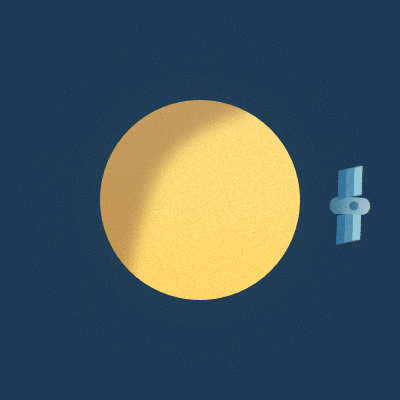
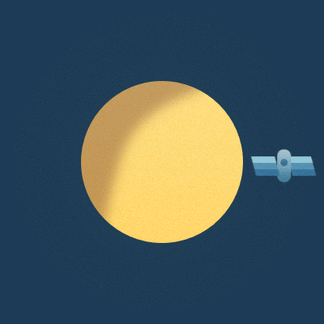
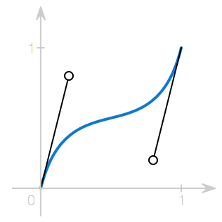

# Animations Explained

The applications we write are rarely a static experience, they adapt to the users needs and change state to perform a multitude of tasks.

When transitioning between these states, it is important to communicate what is going on. Rather than jumping between screens, animations help us explain where the user is coming from and where they are going.

The keyboard slides in and out of view to give the illusion that it is a natural part of the phone that was just hidden below the screen. View controller transitions reinforce the navigational structure of our apps and give the user hints in which direction they are moving. Subtle bounces and collisions make interfaces life-like and evoke physical qualities in what is otherwise a felt-free environment.

Animations are a great way to tell the story of your application and by understanding the basic principles behind animation, designing them will be a lot easier.

## First thing's first

In this article (and for most of the rest of this issue), we will look at Core Animation specifically. While a lot of what you will see can also be accomplished using higher level UIKit methods, Core Animation will give you a better understanding of what is going on. It also allows for a more explicit way of describing animations, which is useful for readers of this article as well as readers of your code.

Before we can have a look at how animations interact with what we see on screen, we need to take a quick look at Core Animation's `CALayer`, which is what the animations operate on.

You probably know that `UIView` instances, as well as layer-backed `NSView`s, modify their `layer` to delegate rendering to the powerful Core Graphics framework. However, it is important to understand that animations, when added to a layer, don't modify its properties directly.

Instead, Core Animation maintains two parallel layer hierarchies: the _model layer tree_ and the _presentation layer tree_[^1]. Layers in the former reflect the well-known state of the layers wheres only layers in the latter approximate the in-flight values of animations.

[^1]: There is actually a third layer tree called the _rendering tree_. Since it's private to Core Animation, we won't cover it here.

Consider adding a fade-out animation to a view. If you, at any point during the animation inspect the layer's `opacity` value, you most likely won't get an opacity that corresponds to what is on screen. Instead, you need to need to inspect the presentation layer to get the correct result.

While you may not set properties of the presentation layer directly, it can be useful to use its current values to create new animations or to interact with layers while an animation is taking place.

By using `-[CALayer presentationLayer]` and `-[CALayer modelLayer]`, you can switch between the two layer hierarchies with ease.

## A basic animation

Probably the most common case is to animate a view's property from one value to another. Consider this example:

> [ Animation of a rectangle moving from left to right ]

Here, we animate our little red rectangle from `50,0` to `150,0`. In order to fill in all the steps along the way, we need to determine where our rectangle is going to be at a given point in time. This is commonly done using linear interpolation:

```
x(t) = x_0 + t * ∆x
```

That is, for a given fraction of the animation `t`, the x-coordinate of the rectangle is the x-coordinate of the starting point `50`, plus the distance to the end point `∆x = 100` multiplied with said fraction.

Using `CABasicAnimation`, we can implement this animation as follows:

```objc
CABasicAnimation *animation = [CABasicAnimation animation];
animation.keyPath = @"position.x";
animation.fromValue = @50;
animation.toValue = @150;
animation.duration = 1;

[rectangle.layer addAnimation:animation forKey:@"basic"];
```

Note that the key path we animate, `position.x` actually contains a member of the `CGPoint` struct stored in the `position` property. This is a very convenient feature of Core Animation, make sure to check [the complete list of supported key paths](https://developer.apple.com/library/ios/documentation/Cocoa/Conceptual/CoreAnimation_guide/Key-ValueCodingExtensions/Key-ValueCodingExtensions.html).

However, when we run this code, we realize that our rocket jumps back to its initial position as soon as the animation is complete. This is because, by default, the animation will not modify the presentation layer beyond its duration, it will even be removed completely at this point.

Once the animation is removed, the presentation layer will fall back to the values of the model layer and since we've never modified that layer's `position`, our space ship reappears right where it started.

There are two ways to deal with this issue:

The first approach is to update the property directly on the model layer. This usually the best approach since it makes the animation completely optional.

Once the animation completes and is removed from the layer, the presentation layer will fall through to value set on the model, which matches the last step of the animation.

```objc
CABasicAnimation *animation = [CABasicAnimation animation];
animation.keyPath = @"position.x";
animation.fromValue = @50;
animation.toValue = @150;
animation.duration = 1;

[rectangle.layer addAnimation:animation forKey:@"basic"];

rectangle.layer.position = CGPointMake(150, 0);
```

Alternatively, you can the animation to remain in its final state by setting its `fillMode` property to ` kCAFillModeForward` and prevent it from being automatically removed by setting `removedOnCompletion` to `NO`.

```objc
CABasicAnimation *animation = [CABasicAnimation animation];
animation.keyPath = @"position.x";
animation.fromValue = @50;
animation.toValue = @150;
animation.duration = 1;

animation.fillMode = kCAFillModeForward;
animation.removedOnCompletion = NO;

[rectangle.layer addAnimation:animation forKey:@"basic"];
```

Check out David's [excellent article on animation timing](http://ronnqvi.st/controlling-animation-timing/) to learn how to get fine-grained control over your animations.

## A multi-stage animation

It's easy to imagine a situation in which you would want to define more than two steps for your animation, yet instead of chaining multiple `CABasicAnimation` instances, we can use the more generic `CAKeyframeAnimation`.

Key frames allow us to define an arbitrary number of points during the animation, and let Core Animation fill in the so called inbetweens.

Let's say we are working on a log-in form for our next iPhone application and want to shake the form whenever the user entered their password incorrectly. Using key-frame animations, this could look a little like so:

> [ Animation of a form element shaking ]

```objc
CAKeyframeAnimation *animation = [CAKeyframeAnimation animation];
animation.keyPath = @"position.x";
animation.values = @[ @0, @10, @-10, @10, @0 ];
animation.keyTimes = @[ @0, @(1 / 6.0), @(3 / 6.0), @(5 / 6.0), @1 ];
animation.duration = 0.2;

animation.additive = YES;

[form.layer addAnimation:animation forKey:@"shake"];
```

The `values` array defines which positions the form should have.

Setting the `keyTimes` property let's us specify, at which point in time the keyframes occur. They are specified as fractions of the total duration of the keyframe animation[^2].

[^2]: Note how I chose different values for transitions from 0 to 30 and from 30 to -30 to maintain a constant velocity.

Setting the `additive` property to `YES` tells Core Animation to add the values of the animation to the value of the model layer, before updating the presentation layer. This allows us to reuse the same animation for all form elements that need updating without having to know their position in advance. Since this property is inherited from `CAPropertyAnimation`, you can also make use of it when employing `CABasicAnimation`.

## Animation along a path

While a simple horizontal shake is not hard to specify in code, animations along complex paths would require us to store a large amount of boxed `CGPoint`s in the keyframe animation's `values` array.  
Thankfully, `CAKeyframeAnimation` offers the more convenient `path` property as an alternative.

For instance, this is how we would animate a view in a circle:



```objc
CGRect boundingRect = CGRectMake(-150, -150, 300, 300);

CAKeyframeAnimation *orbit = [CAKeyframeAnimation animation];
orbit.keyPath = @"position";
orbit.path = CFAutorelease(CGPathCreateWithEllipseInRect(boundingRect, NULL));
orbit.duration = 4;
orbit.additive = YES;
orbit.repeatCount = HUGE_VALF;
orbit.calculationMode = kCAAnimationPaced;
orbit.rotationMode = kCAAnimationRotateAuto;

[satellite.layer addAnimation:orbit forKey:@"orbit"];
```

Using `CGPathCreateWithEllipseInRect()`, we create a circular `CGPath` that we use as the `path` of our keyframe animation. 

`calculationMode` is another way to control the timing of keyframe animations. By setting it to `kCAAnimationPaced`, we let Core Animation apply a constant velocity to the animated object, regardless of how long the individual line segments of our path are.  
Setting it to `kCAAnimationPaced` also disregards any `keyTimes` we would've set.

Setting the `rotationMode` property to `kCAAnimationRotateAuto` ensures that the satellite follows the rotation along the path. By contrast, this is what the animation would look like had we left the property `nil`:



You can achieve a couple of interesting effects using animations with paths,
fellow objc.io author [Ole Begemann](https://twitter.com/oleb) wrote [a great post](http://oleb.net/blog/2010/12/animating-drawing-of-cgpath-with-cashapelayer) about how you can combine path-based animations with `CAShapeLayer` to create cool drawing animations with only a couple of lines of code.

## Timing functions

Let's look at our first example again:

> [ Animation of a rectangle moving from left to right ]

You'll notice that there is something very artificial about the animation of our rectangle. That is because most movements we see in the real world take time to accelerate or decelerate. Objects that instantly reach their top speed and then stop immediately tend to look very unnatural. Unless you're [dancing the robot](https://www.youtube.com/watch?v=o8HkEprSaAs&t=1m2s), that's rarely a desired effect.

In order to give our animation an illusion of inertia, we could factor this into our interpolation function that we saw above. However, we then would have to create a new interpolation function for every desired acceleration or deceleration behavior, an approach that would hardly scale.

Instead, it's common practice to decouple the interpolation of the animated properties from the speed of the animation. Thus, speeding up the animation will give us an effect of an accelerating rectangle without affecting our interpolation function.

We can achieve this by introducing a _timing function_ (also sometimes referred to as an easing function). This function controls the speed of the animation by modifying the fraction of the duration:

```
x(t) = x_0 + e(t) * ∆x
```

The simplest easing function is _linear_, it maintains a constant speed throughout the animation and is effectively what we see above.
In Core Animation, this function is represented by the `CAMediaTimingFunction`
class:

```objc
CABasicAnimation *animation = [CABasicAnimation animation];
animation.keyPath = @"position.x";
animation.fromValue = @50;
animation.toValue = @150;
animation.duration = 1;

animation.timingFunction = [CAMediaTimingFunction functionWithName:kCAMediaTimingFunctionLinear];

[rectangle.layer addAnimation:animation forKey:@"basic"];

rectangle.layer.position = CGPointMake(150, 0);
```

Core Animation comes with a number of built-in easing functions beyond linear, such as:

> [ Lots of rectangles animating with different easing functions ]

It's also possible, within limits, to create your own easing function using `+functionWithControlPoints::::`[^3]. By passing in the _x_ and _y_ components of two control points of a cubic Bézier curve, you can easily create custom easing functions, such as:

[^3]: This method is infamous for having three nameless parameters. Not something that we recommend you make use of in your APIs.

> [ Rectangle ]

```objc
CABasicAnimation *animation = [CABasicAnimation animation];
animation.keyPath = @"position.x";
animation.fromValue = @50;
animation.toValue = @150;
animation.duration = 1;

animation.timingFunction = [CAMediaTimingFunction functionWithControlPoints:0.2:03:0.8:0.8];

[rectangle.layer addAnimation:animation forKey:@"basic"];

rectangle.layer.position = CGPointMake(150, 0);
```

Without going into too much detail on Bézier curves, they are a common technique to create smooth curves in computer graphics. You've probably seen them in vector-based drawing tools such as Sketch or Adobe Illustrator.



The values passed to `+functionWithControlPoints::::` effectively control the position of the handles, the resulting timing function will then adjust the speed of the animation based on the resulting path: the x-axis represents the fraction of the duration, the y axis is the input value of to the interpolation function.

Unfortunately, since the components are clamped to the range of [0–1], it is not possible to create common effects such as anticipation, where an animated object swings back before moving to its target, or overshooting.

I wrote a small library called [RBBAnimation](https://github.com/robb/RBBAnimation) that contains a custom `CAKeyframeAnimation` subclass which allows you to use [more complex easing functions](https://github.com/robb/RBBAnimation#rbbtweenanimation), including bounces or cubic Bézier functions with negative components:

> [ Rectangle with negative component ]

```objc
RBBTweenAnimation *animation = [RBBTweenAnimation animation];
animation.keyPath = @"position.x";
animation.fromValue = @50;
animation.toValue = @150;
animation.duration = 1;

animation.easing = RBBCubicBezier(0.68, -0.55, 0.265, 1.55);
```

> [ Rectangle with bounce ]

```objc
RBBTweenAnimation *animation = [RBBTweenAnimation animation];
animation.keyPath = @"position.x";
animation.fromValue = @50;
animation.toValue = @150;
animation.duration = 1;

animation.easing = RBBEasingFunctionEaseOutBounce;
```

## Further Reading

- [Core Animation Programming Guide](https://developer.apple.com/library/ios/documentation/Cocoa/Conceptual/CoreAnimation_guide/Introduction/Introduction.html)
