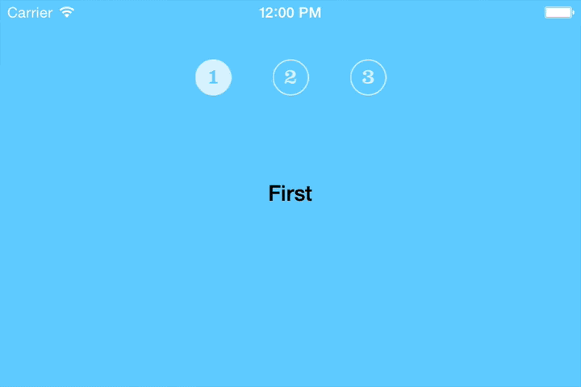
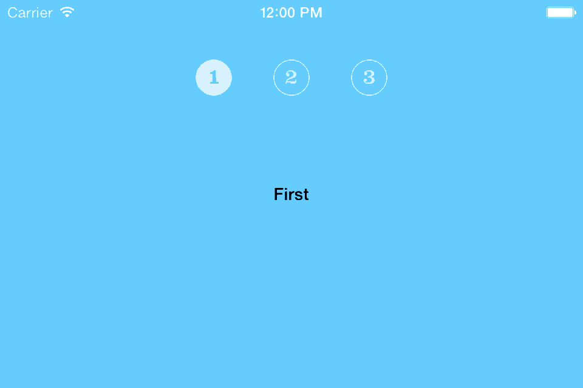
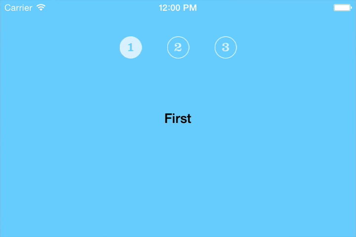

## TODO

- [x] Write article
- [ ] Clean up Xcode project (add documentation, comments, commit tags)
- [ ] Create repository on GitHub 
- [ ] Update GitHub links in article
- [ ] Improve quality of animated GIFs?
- [ ] Come up with a better, shorter title?

# Custom Container View Controller Transitions, iOS 7 Style

In [issue #5](http://www.objc.io/issue-5/index.html), [Chris Eidhof](http://twitter.com/chriseidhof) took us through the new custom [View Controller Transitions](http://www.objc.io/issue-5/view-controller-transitions.html) in iOS 7. He [concluded](http://www.objc.io/issue-5/view-controller-transitions.html#conclusion) (emphasis mine):

> We only looked at animating between two view controllers in a navigation controller, but **you can do the same for** tab bar controllers or **your own custom container view controllers**…

While it is technically true, that you can customize the transition between two view controllers in custom containment, using the iOS 7 API, it is not supported out of the box. Far from. 

Note, that I am talking about custom container view controllers as direct subclasses of `UIViewController`. Not `UITabBarController` or `UINavigationController` subclasses.

There is no ready-to-use API for your custom container `UIViewController` subclass that allows an arbitrary *animation controller* to automatically conduct the transition from one of your child view controllers to another, interactively or non-interactively. I am tempted to say it was not even Apple’s intension to support it. What is supported, are the following transitions:

- Navigation controller pushes and pops
- Tab bar controller selection changes
- Modal presentations and dismissals

In this chapter I will demonstrate how you *can* build a custom container view controller yourself while supporting third-party animation controllers.

If you need to brush up on view controller containment, introduced in iOS 5, make sure to read [Ricky Gregersen](https://twitter.com/rickigregersen)’s “[View Controller Containment](http://www.objc.io/issue-1/containment-view-controller.html)” in the very [first issue](http://www.objc.io/issue-1/).

## Before We Begin

You may ask yourself a question or two at this point, so let me answer them for you:

**Why not just subclass `UINavigationController` or `UITabBarController` and get the support for free?**

Well, sometimes that’s just not what you want. Maybe you want a very specific appearance or behavior, far from what these classes offer, and therefore would have to resort to tricky hacking, risking it to break with any new version of the framework. Or maybe you just want to be in total control of your containment, let alone avoid having to support their specialized functionality.

**OK, but then why not just use `transitionFromViewController:toViewController:duration:options:animations:completion:` and be over with it?**

Another good question, and you may just want to do that. But perhaps you care about your code and want to encapsulate the transition. So why not use a now established and well-proven design pattern? And, heck, as a bonus have support for third-party transition animations thrown in for free.

## Introducing the API

Now, before we start coding – and we will in a minute, I promise – let us set the scene.

The components of the iOS 7 custom view controller transition API are mostly protocols which make them extremely flexible to work with because you can very easily plug them into your existing class hierarchy. The five main components are:

1. **Animation Controllers** which conform to the `UIViewControllerAnimatedTransitioning` protocol and are in charge of performing the actual animations.

2. **Interaction Controllers** controlling the interactive transitions by conforming to the `UIViewControllerInteractiveTransitioning` protocol.

3. **Transitioning Delegates** conveniently vending animation and interaction controllers, depending on the kind of transition to be performed.

4. **Transitioning Contexts** defining metadata about the transition, such as properties of the view controllers and views participating in the transition. These objects conform to the `UIViewControllerContextTransitioning` protocol – *and are created and provided by the system*.

5. **Transition Coordinators** providing methods to run other animations in parallel to the transition animations. They conform to the `UIViewControllerTransitionCoordinator` protocol.

As you know, from otherwise reading this publication, there are interactive and non-interactive transitions. In this chapter, we will concentrate on non-interactive. These are the simplest, so it’s a great place to start. This means that we will be dealing with *animation controllers*, *transitioning delegates*, and *transitioning contexts* from the list above.

Enough talk, let’s get our hands dirty…

## The Project

We will be creating a sample app, featuring a custom container view controller which implements support for custom child view controller transition animations.

The Xcode project, in its three stages, is put in a [repository on GitHub](https://github.com/…/).

### Stage 1: the Basics

The central class in our app is `ContainerViewController` which hosts an array of `UIViewController` instances, trivial `ChildViewController` objects in our case. The container view controller sets up a private subview with tappable icons representing each child view controller:



To switch between child view controllers, tap the icons. At this stage there is no transition animation when switching child view controllers.

Check out the [stage-1](http://github.com/.../tree/stage-1) tag to see the code for the basic app.

### Stage 2: Animating the Transition

When adding a transition animation, we want to support *animation controllers* conforming to `UIViewControllerAnimatedTransitioning`. The protocol defines these three methods, of which the first two are required:

```objc
- (NSTimeInterval)transitionDuration:(id<UIViewControllerContextTransitioning>)transitionContext;
- (void)animateTransition:(id<UIViewControllerContextTransitioning>)transitionContext;
- (void)animationEnded:(BOOL)transitionCompleted;
```

This tells us everything we need to know: when our container view controller is about to perform the animation, we can query the animation controller for the duration and ask it to perform the actual animation. When it is done, we can call `animationEnded:` on the the animation controller, if it implements that optional method.

However, there is one thing we need to figure out first. As you can see from the method signatures above, the two required ones take a *transitioning context* parameter, i.e., an object conforming to `UIViewControllerContextTransitioning`. Normally, when using the built-in classes, the framework creates and passes on this context to our animation controller for us. But in our case, since we are acting as the framework, *we* need to create that object.

This is where the convenience of the heavy use of protocols comes in. Instead of having to override a private class, which obviously is a no-go, we can make our own and just have it conform to the documented protocol.

There is a [lot of methods](https://developer.apple.com/library/ios/documentation/uikit/reference/UIViewControllerContextTransitioning_protocol/Reference/Reference.html), though, and they are all required. But we can ignore some of them for now, because we are currently only supporting non-interactive transitions.

Just like the framework does, we define a private `NSObject <UIViewControllerContextTransitioning>` class. In our specialized case, we create a private `_TransitionContext` class and implement the initializer like this:

```objc
- (instancetype)initWithFromViewController:(UIViewController *)fromViewController toViewController:(UIViewController *)toViewController goingRight:(BOOL)goingRight {
    NSAssert ([fromViewController isViewLoaded] && fromViewController.view.superview, @"The fromViewController view must reside in the container view upon initializing the transition context.");
    
    if ((self = [super init])) {
        self.presentationStyle = UIModalPresentationCustom;
        self.containerView = fromViewController.view.superview;
        self._viewControllers = @{
            UITransitionContextFromViewControllerKey:fromViewController,
            UITransitionContextToViewControllerKey:toViewController,
		};
		
    CGFloat travelDistance = (goingRight ? -self.containerView.bounds.size.width : self.containerView.bounds.size.width);
        self._disappearingFromRect = self._appearingToRect = self.containerView.bounds;
        self._disappearingToRect = CGRectOffset (self.containerView.bounds, travelDistance, 0);
        self._appearingFromRect = CGRectOffset (self.containerView.bounds, -travelDistance, 0);
    }
    
    return self;
}
```

We basically capture state, including initial and final frames for the appearing and disappearing views. Properties starting with an underscore are private and don’t expose their accessors.

Notice, our initializer requires information about whether we are going right or not. In our specialized `ContainerViewController` context, where buttons are arranged horizontally next to each other, the transition context is recording information about their positional relationship by setting the respective frames. The animation controller, or *animator*, can choose to use this when composing the animation. 

We could gather this information in other ways, but it would require the animator to know about the `ContainerViewController` and its view controllers, and we don’t want that. The animator should only concern itself with the context, which is passed to it, because that would, ideally, make the animator reusable in other contexts.

We will keep this in mind when making our own animation controller next, now that we have the transition context available to us.

You probably remember that it was exactly what we did in [View Controller Transitions](http://www.objc.io/issue-5/view-controller-transitions.html), [issue #5]((http://www.objc.io/issue-5/). So why not just use that? In fact, because the extensive use of protocols in this framework, we can take the animation controller, the `Animator` class, from that project and plug it right in to ours – without any modifications.

Using an `Animator` instance to animate our transition essentially looks like this:

```objc
[fromViewController willMoveToParentViewController:nil];
[self addChildViewController:toViewController];

Animator *animator = [[Animator alloc] init];

NSUInteger fromIndex = [self.viewControllers indexOfObject:fromViewController];
NSUInteger toIndex = [self.viewControllers indexOfObject:toViewController];
_TransitionContext *transitionContext = [[_TransitionContext alloc] initWithFromViewController:fromViewController toViewController:toViewController goingRight:toIndex > fromIndex];

transitionContext.animated = YES;
transitionContext.interactive = NO;
transitionContext.completionBlock = ^(BOOL didComplete) {
    [fromViewController.view removeFromSuperview];
    [fromViewController removeFromParentViewController];
    [toViewController didMoveToParentViewController:self];
};

[animator animateTransition:transitionContext];
```

Most of this is the required container view controller song and dance, and finding out whether we going left or right. Doing the animation is basically three lines of code: 1) creating the transition context, 2) creating the animator, and 3) triggering the animation.

With that, the transition now looks like this:



Pretty cool. We haven’t even written any animation code ourselves!

This is reflected in the code with the [stage-2](https://github.com/.../tree/stage-2) tag. To see the full extend of the stage 2 changes, check the [diff against stage 1](https://github.com/...).

### Stage 3: Shrink-Wrapping

One last thing I think we should do is shrink-wrapping `ContainerViewController` so that it:

1. comes with its own default transition animation and
2. supports a delegate for vending alternative animation controllers.

This entails conveniently removing the dependency to the `Animator` class as well as creating a delegate protocol.

We define our protocol as:

```objc
@protocol ContainerViewControllerDelegate <NSObject>
@optional
- (void)containerViewController:(ContainerViewController *)containerViewController didSelectViewController:(UIViewController *)viewController;
- (id <UIViewControllerAnimatedTransitioning>)containerViewController:(ContainerViewController *)containerViewController animationControllerForTransitionFromViewController:(UIViewController *)fromViewController toViewController:(UIViewController *)toViewController;
```

The `containerViewController:didSelectViewController:` method just makes it easier to integrate `ContainerViewController` into more feature complete apps. 

The interesting method is `containerViewController:animationControllerForTransitionFromViewController:toViewController:`, of course, which can be compared to the following container view controller delegate protocol methods in UIKit:

- `tabBarController:animationControllerForTransitionFromViewController:toViewController:` (`UITabBarControllerDelegate`)
- `navigationController:animationControllerForOperation:fromViewController:toViewController:` (`UINavigationControllerDelegate`)

All these methods return an `id<UIViewControllerAnimatedTransitioning>` object.

Instead of always using an `Animator` object, we can now ask our delegate for an animation controller:

```objc
id<UIViewControllerAnimatedTransitioning>animator = nil;
if ([self.delegate respondsToSelector:@selector (containerViewController:animationControllerForTransitionFromViewController:toViewController:)]) {
    animator = [self.delegate containerViewController:self animationControllerForTransitionFromViewController:fromViewController toViewController:toViewController];
}
animator = (animator ?: [[_AnimatedTransition alloc] init]);
```

If we have a delegate, and it returns an animator, we will use that. Otherwise we will create our own, private default animator of class `_AnimatedTransition`. We will implement this next.

Although the default animation is somewhat different from that of `Animator`, the code looks surprisingly similar. Here is the full implementation:

```objc
@implementation _AnimatedTransition

static CGFloat const kChildViewPadding = 16;
static CGFloat const kDamping = 0.75f;
static CGFloat const kInitialSpringVelocity = 0.5f;

- (NSTimeInterval)transitionDuration:(id<UIViewControllerContextTransitioning>)transitionContext {
    return 1;
}

- (void)animateTransition:(id<UIViewControllerContextTransitioning>)transitionContext {
    
    UIViewController* toViewController = [transitionContext viewControllerForKey:UITransitionContextToViewControllerKey];
    UIViewController* fromViewController = [transitionContext viewControllerForKey:UITransitionContextFromViewControllerKey];
    
    // When sliding the views horizontally, in and out, figure out whether we are going left or right.
    BOOL goingRight = ([transitionContext initialFrameForViewController:toViewController].origin.x < [transitionContext finalFrameForViewController:toViewController].origin.x);
    
    CGFloat travelDistance = [transitionContext containerView].bounds.size.width + kChildViewPadding;
    CGAffineTransform travel = CGAffineTransformMakeTranslation (goingRight ? travelDistance : -travelDistance, 0);
    
    [[transitionContext containerView] addSubview:toViewController.view];
    toViewController.view.alpha = 0;
    toViewController.view.transform = CGAffineTransformInvert (travel);
    
    [UIView animateWithDuration:[self transitionDuration:transitionContext] delay:0 usingSpringWithDamping:kDamping initialSpringVelocity:kInitialSpringVelocity options:0x00 animations:^{
        fromViewController.view.transform = travel;
        fromViewController.view.alpha = 0;
        toViewController.view.transform = CGAffineTransformIdentity;
        toViewController.view.alpha = 1;
    } completion:^(BOOL finished) {
        fromViewController.view.transform = CGAffineTransformIdentity;
        [transitionContext completeTransition:![transitionContext transitionWasCancelled]];
    }];
}

@end
```

Note that even if the view frames haven’t been set to reflect the positional relationships, the code would still work, albeit always transition in the same direction. This class can therefore still be used in other codebases.

The transition animation now looks like this:



In the code with the [stage-3](https://github.com/.../tree/stage-3) tag, setting the delegate in the app delegate has been [commented out](https://github.com/.../) in order to see the default animation in action. Set it back in to use `Animator` again. You may want to check out the [full diff against stage-2](https://github.com/...).

We now have a self-contained `ContainerViewController` with a nicely animated default transition which developers can override with their own, iOS 7 custom animation controller (`UIViewControllerAnimatedTransitioning`) objects – even without needing access to our source code.

## Conclusion

In this, rather lengthy, chapter we looked at making our custom container view controller a first-class UIKit citizen by integrating it with the Custom View Controller Transitions, new in iOS 7.

This means you can apply your own, non-interactive, transition animation to our custom container view controller. We saw that because we could take an existing transition class, from seven issues ago, and plug it right in – without modification.

This is perfect if you are distributing your custom container view controller as part of a library or framework, or just want your code to be reusable.

Note that we only support non-interactive transitions so far. Next step is supporting interactive transitions as well.

I will leave that as an exercise for you. It is somewhat more complex because we are basically mimicking the framework behavior, which is all guesswork really.

## Further Indulgence

- iOS 7 Tech Talks Videos, 2014: [“Architecting Modern Apps, Part 1”](https://developer.apple.com/tech-talks/videos/index.php?id=3#3) (07:23-31:27)
- Link to the repository on GitHub
