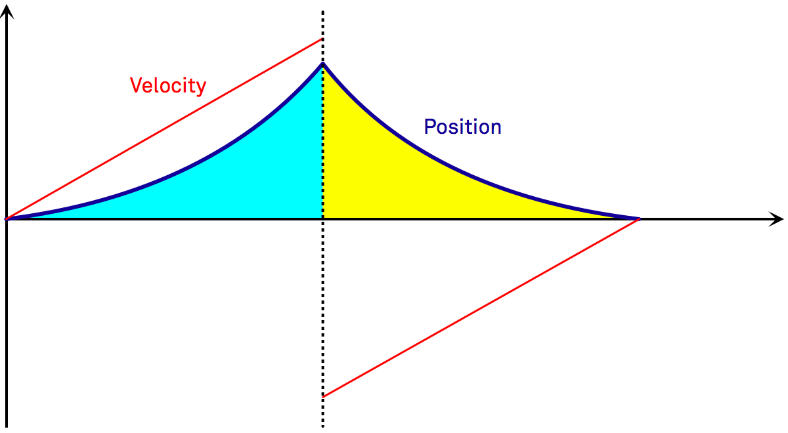

When Steve Jobs introduced the first iPhone in 2007 the touch screen interaction had a certain kind of magic to it. A prime example of this was his [first demonstration of scrolling a table view](http://www.youtube.com/watch?v=t4OEsI0Sc_s&t=16m9s). You can hear in the reaction of the audience how impressive was back then what seems the most normal thing to us today. A little bit later in the presentation he underlined this point by quoting somebody he had given a demo to before: ["You got me at scrolling"](https://www.youtube.com/watch?v=t4OEsI0Sc_s&t=22m10s). 

What was it about scrolling that created this "wow" effect?

Scrolling was a perfect example of direct manipulation through capacitive touch displays. The scroll view obeyed the movements of your finger so closely, and it continued the motion seamlessly after you let go. From there it decelerated in a natural way and even exhibited a nice bounce when it hit its boundaries. Scrolling was responsive at any time and just behaved like an object from the real world.

## State of Animations

Most animations in iOS still don't live up to the standard that scrolling has set on the original iPhone. 
They are fire-and-forget animations, that cannot be interacted with once they're running (for example the unlock animation, the animations opening and closing groups on the home screen, and the navigation controller animations to name just a few examples).

However, there are some apps out there that bring that aspect of always in control, direct manipulation to all animations they use. It's a big difference in how these apps feel compared to the rest. Prominent examples of such apps are the original Twitter iPad app and the current Facebook Paper app. But for the time being, apps that fully embrace direct manipulation and always interruptible animations are still rare. This creates an opportunity for apps that do this well, as they have a very different, high quality feel to them. 

## Challenges of Truly Interactive Animations

Using `UIView` or `CAAnimation` animations has two big problems when it comes to interactive animations: Those animations separate what you see on the screen from what the actual spacial properties are on the layer, and they directly manipulate the spacial properties.

### Separation of Model and Presentation

Core Animation is designed in a way that it decouples the layer's model properties from what you see on the screen (the presentation layer). This makes it more differenceicult to create animations you can interact with at any time, because those two representations do not match. It's up to you to do the manual work to get them in sync before you change the animation:

    view.layer.center = view.layer.presentationLayer.center;
    [view.layer removeAnimationForKey:@"animation"];

### Direct vs. Indirect Control

The bigger problem with `CAAnimation` animations is that they directly operate on the spatial properties of a layer. This means for example that you specify that a layer should animate from position `(100, 100)` to position `(300, 300)`. If you would want to stop this animation halfway and to animate the layer back to where it came from, things get very complicated. If you would simply remove the current animation and add a new animation, then the layer's velocity would be discontinous.

What we want to have though is a nice smooth deceleration and acceleration.

This only becomes feasible once you start controlling animations *indirectly*, i.e. through simulated forces acting on the view. The new animation needs to take the layer's current velocity *vector* as input in order to produce a smooth result.

Looking at the `UIView` animation API for spring animations (`animateWithDuration:delay:usingSpringWithDamping:initialSpringVelocity:options:animations:completion:`) you'll notice that the velocity is a `CGFloat`. So while you can give the animation an initial velocity in the direction the animation moves the view, you cannot tell the animation that the view is for example currently moving at a certain velocity perpendicular to the new animation direction. In order to enable this, the velocity needs to expressed as a vector

## Solutions

### UIKit Dynamics

With iOS 7 Apple introduced the animation framework UIKit Dynamics (see WWDC 2013 sessions [206](https://developer.apple.com/videos/wwdc/2013/index.php?id=206) and [221](https://developer.apple.com/videos/wwdc/2013/index.php?id=221)). UIKit Dynamics is based on a pseudo-physics engine that can animate everything that implements the [`UIDynamicItem`](TODO) protocol by adding specific behaviors to an animator object. This framework is very powerful and enables complex behaviors of many items like attachments and collisions. Take a look at the sample [dynamics catalog](https://developer.apple.com/library/ios/samplecode/DynamicsCatalog/Introduction/Intro.html) to see what's available.

Since animations with UIKit Dynamics are driven indirectly as we discussed above, it enables us to implement truly interactive animations that can be interrupted  and that exhibit continuous acceleration behavior at any time. At the same time the abstraction of UIKit Dynamics at the physics level can also seem overwhelming for the kind of animations that we need in user interfaces most of the time. In most cases we'll only use a very small subset of its capabilities.

#### Defining Behaviors

In order to implement our sliding panel behavior we'll make use of two different behaviors that come with UIKit Dynamics: [`UIAttachmentBehavior`](TODO) and [`UIDynamicItemBehavior`](TODO). The attachment behavior fulfills the role of a spring pulling our view towards its target point. The dynamic item behavior on the other hand defines intrinsic properties of the view like its friction coefficient.

To package these two behaviors for our sliding panel we'll create our own behavior subclass:

    @interface PaneBehavior : UIDynamicBehavior
    
    @property (nonatomic) CGPoint targetPoint;
    @property (nonatomic) CGPoint velocity;
    
    - (instancetype)initWithItem:(id <UIDynamicItem>)item;
    
    @end

We initialize this behavior with one dynamic item and then can set its target point and velocity to whatever we want. Internally we create the attachment behavior and the dynamic item behavior and add both as child behavior to our custom behavior:

    - (void)setup
    {
        UIAttachmentBehavior *attachmentBehavior = [[UIAttachmentBehavior alloc] initWithItem:self.item attachedToAnchor:CGPointZero];
        attachmentBehavior.frequency = 3.5;
        attachmentBehavior.damping = .4;
        attachmentBehavior.length = 0;
        [self addChildBehavior:attachmentBehavior];
        self.attachmentBehavior = attachmentBehavior;
        
        UIDynamicItemBehavior *itemBehavior = [[UIDynamicItemBehavior alloc] initWithItems:@[self.item]];
        itemBehavior.density = 100;
        itemBehavior.resistance = 10;
        [self addChildBehavior:itemBehavior];
        self.itemBehavior = itemBehavior;
    }

In order to make the `targetPoint` and `velocity` properties affect the item's behavior we overwrite their setters and modify the corresponding properties on the attachment and item behaviors respectively. For the target point this is very simple:

    - (void)setTargetPoint:(CGPoint)targetPoint
    {
        _targetPoint = targetPoint;
        self.attachmentBehavior.anchorPoint = targetPoint;
    }

For the velocity property we have to jump through one more hoop since the dynamic item behavior only allows relative changes in velocity. That means that in order to set the velocity to an absolute value, we first have to get its current velocity and then add the difference to the target velocity:

    - (void)setVelocity:(CGPoint)velocity
    {
        _velocity = velocity;
        CGPoint currentVelocity = [self.itemBehavior linearVelocityForItem:self.item];
        CGPoint velocityDelta = CGPointMake(velocity.x - currentVelocity.x, velocity.y - currentVelocity.y);
        [self.itemBehavior addLinearVelocity:velocityDelta forItem:self.item];
    }

#### Putting the Behavior to Use

Our sliding panel has three different states: it is either at rest in one of its end positions, it is being dragged by the user, or it is animating without the users interaction towards one of its end points.

In order to implement this we have to do some work when transitioning from user dragging the panel to it animating towards its final position and back. That's where have to make sure that we get a smooth transition from the dragging to the animation phase. When the user stops dragging the panel, it sends a message to its delegate. Within this method we decide towards what position the panel should animate and add our custom `PaneBehavior` with this endpoint and -- very important -- the initial velocity to ensure a smooth transition from dragging to animation.

    - (void)draggableView:(DraggableView *)view draggingEndedWithVelocity:(CGPoint)velocity
    {
        PaneState targetState = velocity.y >= 0 ? PaneStateClosed : PaneStateOpen;
        [self animatePaneToState:targetState initialVelocity:velocity];
    }

    - (void)animatePaneToState:(PaneState)targetState initialVelocity:(CGPoint)velocity
    {
        if (!self.paneBehavior) {
            PaneBehavior *behavior = [[PaneBehavior alloc] initWithItem:self.pane];
            self.paneBehavior = behavior;
        }
        self.paneBehavior.targetPoint = [self targetPointForState:targetState];
        if (!CGPointEqualToPoint(velocity, CGPointZero)) {
            self.paneBehavior.velocity = velocity;
        }
        [self.animator addBehavior:self.paneBehavior];
        self.paneState = targetState;
    }

As soon as the user puts his finger down on the panel again, we have to remove the dynamic behavior from the animator in order to not interfere with pan gesture:

    - (void)draggableViewBeganDragging:(DraggableView *)view
    {
        [self.animator removeAllBehaviors];
    }
    
We don't only allow the panel to be dragged, but it can also be tapped to toggle from one position to the other. When a tap happens we immediately adjust the panel's target position. Since we don't control the animation directly but via spring and friction forces, the animation will proceed smoothly without abruptly reversing its movement.

    - (void)didTap:(UITapGestureRecognizer *)tapRecognizer
    {
        PaneState targetState = self.paneState == PaneStateOpen ? PaneStateClosed : PaneStateOpen;
        [self animatePaneToState:targetState initialVelocity:CGPointZero];
    }

And that's pretty much all there is to it. You can check out the whole example project on [GitHub](TODO). 

To reiterate the crucial point: UIKit Dynamics allows us to drive the animation indirectly by simulating forces on the view (in our case spring and friction forces). This indirection enables us to interact with the view at any time while maintaining a continuous velocity curve.

Now that we have implemented this interaction with UIKit Dynamics, we'll take a look behind the scenes. Animations like the in our example only use a tiny fraction of UIKit Dynamic's capabilities, and it's surprisingly simple to implement them yourself. That's a good exercise to understand what's going on, but it can also be necessary if you either don't have UIKit Dynamics available (e.g. on the Mac) or it's not a good abstraction for your use case.

### The Physics

Let's first take a look at some basic physics necessary to drive a spring animation like we created before using UIKit Dynamics. To simplify things, we'll look at a purely one dimensional case (as it is the case in our example), although introducing the second dimension is straightforward.

The objective is to calculate the new position of the panel based on its current position and the time that has elapsed since the last animation tick. This can be expressed as

    y = y0 + deltaY
    
The position delta is a function of the velocity and the time:

    deltaY = v * deltaT
    
The velocity can be calculated as the previous velocity plus the velocity delta caused by the force acting on the view:

    v = v0 + deltaV

The change in velocity can be calculated by the impulse applied to the view:

    deltaV = F * deltaT / m

Now let's take a look at the force acting on the view. In order to get the spring effect, we have to combine a spring force with friction force:

    F = fSpring + fFriction
    
The spring force comes straight from the text book:

    fSpring = k * x
    
where `k` is the spring constant and `x` is the distance of the view to its target end point (the length of the spring). Therefore we can also write this as

    fSpring = k * abs(yTarget - y0)

We calculate friction as being proportional to the view's velocity:

    fFriction = mu * v
    
`mu` again is a simple friction constant. You could come up with other ways to calculate the friction force, but this works well to create the animation we want to have.

Putting this together the force on the view is calculated as

    F = k * abs(yTarget - y0) + mu * v
    
To simplify things a bit more we'll simply set the view's mass to `1` so that we can calculate the change in position as

    deltaY = (v0 + (k * abs(yTarget - y0) + mu * v) * deltaT) * deltaT

### Driving Animations Yourself

For the animations you'll use most of the time in your apps, e.g. simple spring animations, it's actually surprisingly simple to drive those yourself.
It's a good exercise to lift the lid of the huge black box of UIKit Dynamics and to see what it takes to implement simple interactive animations "manually".

We're going to cheat on the math of the spring animation a bit to make it more simple, which is perfectly fine for our purposes. We don't need to have a real world physics simulation.
Explain the calculation of an animation tick with the layer's position and velocity as input.

Show the same control center style example from before with a manually driven animation.

### Back to the Mac

There's nothing like UIKit Dynamics available on Mac at this time. If you want to create truly interactive animations here, you have to take the route of driving those animations yourself.
Now that we've already shown how to implement this on iOS, it's very simple to make the same example work on OS X.

Show the example from before running on OS X.

## POP ?

Would be cool if we could say a few words about Facebook's POP framework. I've contacted Kimon Tsinteris about this, let's see if we can get something done here in time.

## The Road Ahead

With iOS 7's shift away from visual imitation of real world objects towards a stronger focus on the UI's behaviour, truly interactive animations are a great way to stand out.
It's a way to extend the magic of the original iPhone's scrolling behaviour into every aspect of the interaction.
Interactive animations are fulfilling the promise and increasingly the expectations of users that comes with touchscreen devices. 

