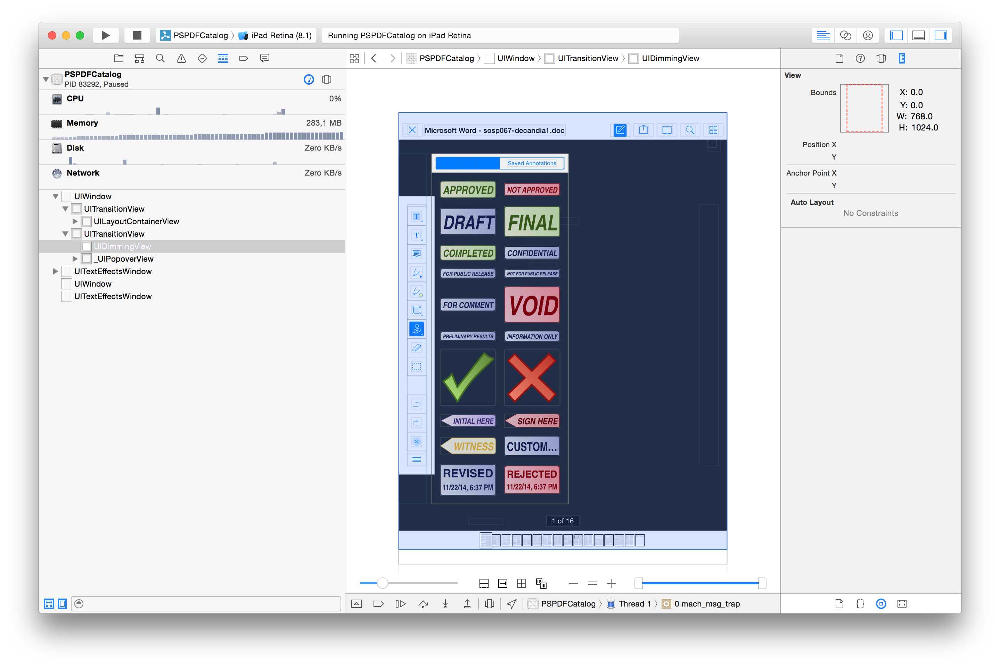
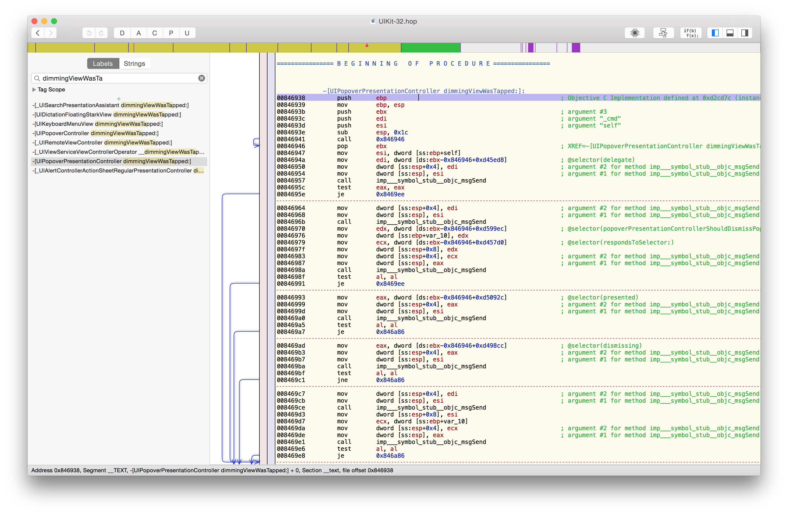
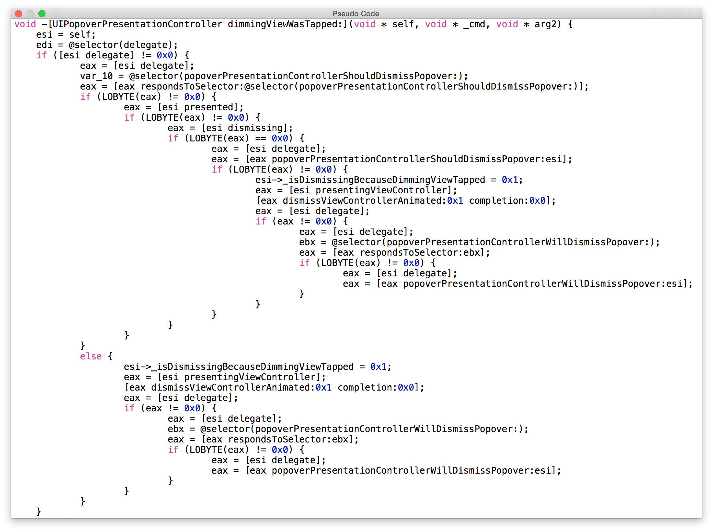

# Debugging Code

Nobody writes perfect code, and debugging is something everyone of us should be able to do well. Instead of a random list of tips, I'll walk you through a bug that turned out to be a regression in UIKit, and show you the workflow I used to understand, isolate and ultimately work around the issue.

<<Insert GIF that shows off the bug from Stefan's Issue Report>>

### Backstory

We received a bug report where quickly tapping on a button that presented a popover dismissed the popover but also the parent view controller. The first part of reproducing the issue was covered since we got a sample that showed the exact issue.

### Understanding the bug

My first guess was that we might have code that dismisses the view controller, and we wrongfully dismiss the parent. However, when using Xcode's integrated view debugging feature, it was clear that there was a global `UIDimmingView` that was the first responder for touch input.



Xcode added the "Debug View Hierarchy" feature in Xcode 6 and it's likely that Apple got inspired by the popular Reveal and SparkInspector, which basically do the same and are even better in many ways, like allowing to actually edit properties in the views.

Before there was visual debugging, the common way to inspect the hierarchy was using `po [[UIWindow keyWindow] recursiveDescription]` in *lldb*, which prints out [the whole view hierarchy in text form](https://gist.github.com/steipete/5a3c7a3b6e80d2b50c3b). 

Similar to inspecting the view hiararchy, we can also inspect the view controller hierarchy using `po [[[UIWindow keyWindow] rootViewController] _printHierarchy]`. The private `_printHierarchy` is new in iOS 8, and not documented.

```
lldb) po [[[UIWindow keyWindow] rootViewController] _printHierarchy]
<PSPDFNavigationController 0x7d025000>, state: disappeared, view: <UILayoutContainerView 0x7b3218d0> not in the window
   | <PSCatalogViewController 0x7b3100d0>, state: disappeared, view: <UITableView 0x7c878800> not in the window
   + <UINavigationController 0x8012c5d0>, state: appeared, view: <UILayoutContainerView 0x8012b7a0>, presented with: <_UIFullscreenPresentationController 0x80116c00>
   |    | <__PSPDFHooked_PSPDFViewController 0x7d05ae00>, state: appeared, view: <PSPDFViewControllerView 0x80129640>
   |    |    | <PSPDFContinuousScrollViewController 0x7defa8e0>, state: appeared, view: <UIView 0x7def1ce0>
   |    + <PSPDFNavigationController 0x7d21a800>, state: appeared, view: <UILayoutContainerView 0x8017b490>, presented with: <UIPopoverPresentationController 0x7f598c60>
   |    |    | <PSPDFContainerViewController 0x8017ac40>, state: appeared, view: <UIView 0x7f5a1380>
   |    |    |    | <PSPDFStampViewController 0x8016b6e0>, state: appeared, view: <UIView 0x7f3dbb90>
```

### Adding breakpoints

The next step is adding breakpoints to see who actually is dismissing our view controller. We are lazy and since there is already an implementation of `viewWillDisappear:`, we just set a breakpoint there. With the `bt` command you can print the breakpoint in lldb, which is useful if you want to send it to someone else. `bt all` will do the same, but capturing all threads.

```
(lldb) bt
* thread #1: tid = 0x1039b3, 0x004fab75 PSPDFCatalog`-[PSPDFViewController viewWillDisappear:](self=0x7f354400, _cmd=0x03b817bf, animated='\x01') + 85 at PSPDFViewController.m:359, queue = 'com.apple.main-thread', stop reason = breakpoint 1.1
  * frame #0: 0x004fab75 PSPDFCatalog`-[PSPDFViewController viewWillDisappear:](self=0x7f354400, _cmd=0x03b817bf, animated='\x01') + 85 at PSPDFViewController.m:359
    frame #1: 0x0064b99a PSPDFCatalog`__71-[UIViewController(.block_descriptor=0x80b60d60, _self=0x7f354400, animated='\x01') pspdf_addViewAppearanceAction:selector:]_block_invoke133 + 250 at UIViewController+PSPDFKitAdditions.m:158
    frame #2: 0x033ac782 UIKit`-[UIViewController _setViewAppearState:isAnimating:] + 706
    frame #3: 0x033acdf4 UIKit`-[UIViewController __viewWillDisappear:] + 106
    frame #4: 0x033d9a62 UIKit`-[UINavigationController viewWillDisappear:] + 115
    frame #5: 0x033ac782 UIKit`-[UIViewController _setViewAppearState:isAnimating:] + 706
    frame #6: 0x033acdf4 UIKit`-[UIViewController __viewWillDisappear:] + 106
    frame #7: 0x033c46a1 UIKit`-[UIViewController(UIContainerViewControllerProtectedMethods) beginAppearanceTransition:animated:] + 200
    frame #8: 0x03380ad8 UIKit`__56-[UIPresentationController runTransitionForCurrentState]_block_invoke + 594
    frame #9: 0x033b47ab UIKit`__40+[UIViewController _scheduleTransition:]_block_invoke + 18
    frame #10: 0x0327a0ce UIKit`___afterCACommitHandler_block_invoke + 15
    frame #11: 0x0327a079 UIKit`_applyBlockToCFArrayCopiedToStack + 415
    frame #12: 0x03279e8e UIKit`_afterCACommitHandler + 545
    frame #13: 0x060669de CoreFoundation`__CFRUNLOOP_IS_CALLING_OUT_TO_AN_OBSERVER_CALLBACK_FUNCTION__ + 30
    frame #14: 0x06066920 CoreFoundation`__CFRunLoopDoObservers + 400
    frame #15: 0x0605c35a CoreFoundation`__CFRunLoopRun + 1226
    frame #16: 0x0605bbcb CoreFoundation`CFRunLoopRunSpecific + 443
    frame #17: 0x0605b9fb CoreFoundation`CFRunLoopRunInMode + 123
    frame #18: 0x06c3224f GraphicsServices`GSEventRunModal + 192
    frame #19: 0x06c3208c GraphicsServices`GSEventRun + 104
    frame #20: 0x032508b6 UIKit`UIApplicationMain + 1526
    frame #21: 0x000a119d PSPDFCatalog`main(argc=1, argv=0xbffcd65c) + 141 at main.m:15
    frame #22: 0x06613ac9 libdyld.dylib`start + 1
(lldb) 
```

When we inspect the stack trace, we notice that it's actually too late, and we're called back from an already scheduled animation. We need to add out breakpoints earlier. In this case we are intersted in calls to `-[UIViewController dismissViewControllerAnimated:completion:]`. We add this *symbolic breakpoint* to Xcode's breakpoint list and run the sample again. The Xcode breakpoint interface is very powerful, allowing you to add conditions, skip counts or even custom actions like playing a sound effect and autimatically continuing. We don't need these features here, but they're a [powerful weapon when needed](http://www.peterfriese.de/debugging-tips-for-ios-developers/).

```
(lldb) bt
* thread #1: tid = 0x1039b3, 0x033bb685 UIKit`-[UIViewController dismissViewControllerAnimated:completion:], queue = 'com.apple.main-thread', stop reason = breakpoint 7.1
  * frame #0: 0x033bb685 UIKit`-[UIViewController dismissViewControllerAnimated:completion:]
    frame #1: 0x03a7da2c UIKit`-[UIPopoverPresentationController dimmingViewWasTapped:] + 244
    frame #2: 0x036153ed UIKit`-[UIDimmingView handleSingleTap:] + 118
    frame #3: 0x03691287 UIKit`_UIGestureRecognizerSendActions + 327
    frame #4: 0x0368fb04 UIKit`-[UIGestureRecognizer _updateGestureWithEvent:buttonEvent:] + 561
    frame #5: 0x03691b4d UIKit`-[UIGestureRecognizer _delayedUpdateGesture] + 60
    frame #6: 0x036954ca UIKit`___UIGestureRecognizerUpdate_block_invoke661 + 57
    frame #7: 0x0369538d UIKit`_UIGestureRecognizerRemoveObjectsFromArrayAndApplyBlocks + 317
    frame #8: 0x03689296 UIKit`_UIGestureRecognizerUpdate + 3720
    frame #9: 0x032a226b UIKit`-[UIWindow _sendGesturesForEvent:] + 1356
    frame #10: 0x032a30cf UIKit`-[UIWindow sendEvent:] + 769
    frame #11: 0x03268549 UIKit`-[UIApplication sendEvent:] + 242
    frame #12: 0x0327837e UIKit`_UIApplicationHandleEventFromQueueEvent + 20690
    frame #13: 0x0324cb19 UIKit`_UIApplicationHandleEventQueue + 2206
    frame #14: 0x060671df CoreFoundation`__CFRUNLOOP_IS_CALLING_OUT_TO_A_SOURCE0_PERFORM_FUNCTION__ + 15
    frame #15: 0x0605cced CoreFoundation`__CFRunLoopDoSources0 + 253
    frame #16: 0x0605c248 CoreFoundation`__CFRunLoopRun + 952
    frame #17: 0x0605bbcb CoreFoundation`CFRunLoopRunSpecific + 443
    frame #18: 0x0605b9fb CoreFoundation`CFRunLoopRunInMode + 123
    frame #19: 0x06c3224f GraphicsServices`GSEventRunModal + 192
    frame #20: 0x06c3208c GraphicsServices`GSEventRun + 104
    frame #21: 0x032508b6 UIKit`UIApplicationMain + 1526
    frame #22: 0x000a119d PSPDFCatalog`main(argc=1, argv=0xbffcd65c) + 141 at main.m:15
    frame #23: 0x06613ac9 libdyld.dylib`start + 1
```

Now we're talking! As expected, the fullscreen `UIDimmingView` receives our touch and processes it in `handleSingleTap:`, then forwarding it to `UIPopoverPresentationController`'s `dimmingViewWasTapped:`, which dismisses the controller (as it should). However, when we tap quickly, this breakpoint is called twice. Is there a second dimming view? Is it called on the same instance? We only have the assembly on this breakpoint, so calling `po self` will not work. With some basic knowledge of assembly and function calling conventions, we can still get it. The [iOS ABI Function Call Guide](http://developer.apple.com/library/ios/#documentation/Xcode/Conceptual/iPhoneOSABIReference/Introduction/Introduction.html) and the [Mac OS X ABI Function Call Guide](http://developer.apple.com/library/mac/#documentation/DeveloperTools/Conceptual/LowLevelABI/000-Introduction/introduction.html) that is used in the iOS Simulator are both great resources and will improve your debugging skills.

For the 32-bit architecture, the stack is saved in $esp, so you can use `po *(int*)($esp+4)` to get self, and `p (SEL)*(int*)($esp+8)` to get _cmd in Objective-C methods. The first value in $esp is the return address.

Another way is to hook into the function to add a log statement. We could swizzle the class and then call our own code on it. Manually swizzling just to be able to debug more conveniently however isn't really time efficant. A while back I wrote a small library called [*Aspects*](http://github.com/steipete/Aspects) that does exactly that. It can be used in production code but I mostly use it for debugging and to write test cases. (If you're curious about Aspects, you can [learn more here.](https://speakerdeck.com/steipete/building-aspects))

```objc
#import "Aspects.h"

[UIPopoverPresentationController aspect_hookSelector:NSSelectorFromString(@"dimmingViewWasTapped:") withOptions:0 usingBlock:^(id <AspectInfo> info, UIView *tappedView) {
    NSLog(@"%@ dimmingViewWasTapped:%@", info.instance, tappedView);
} error:NULL];
```

This hooks into `dimmingViewWasTapped:`, which is private - thus we use `NSSelectorFromString`. You can verify that this method exists and also look up all other private and public methods of pretty much every framework class by using the [iOS-Runtime-Headers](https://github.com/nst/iOS-Runtime-Headers). This project uses the fact that one can't really hide methods at runtime to query all classes and create a more complete header than what Apple gives us. (Of course, actually calling private API is not a good idea - this is just to better understand what's going on.)

With the log message in the hooked method, we get following output:

```
2014-11-22 19:15:51.660 PSPDFCatalog[84049:1079574] <UIPopoverPresentationController: 0x7fd09f91c530> dimmingViewWasTapped:<UIDimmingView: 0x7fd09f92f800; frame = (0 0; 768 1024); opaque = NO; autoresize = W+H; gestureRecognizers = <NSArray: 0x7fd09f940ce0>; layer = <CALayer: 0x7fd09f92fd80>>
2014-11-22 19:15:51.685 PSPDFCatalog[84049:1079574] <UIPopoverPresentationController: 0x7fd09f91c530> dimmingViewWasTapped:<UIDimmingView: 0x7fd09f92f800; frame = (0 0; 768 1024); opaque = NO; autoresize = W+H; gestureRecognizers = <NSArray: 0x7fd09f940ce0>; layer = <CALayer: 0x7fd09f92fd80>>
```

We see that the object address is the same, so our poor dimming view really is called twice. We can use Aspects again to see on what controller the dismiss is actually called:

```objc
[UIViewController aspect_hookSelector:@selector(dismissViewControllerAnimated:completion:) withOptions:0 usingBlock:^(id <AspectInfo> info) {
    NSLog(@"%@ dismissViewControllerAnimated", info.instance);
} error:NULL];
```

```
2014-11-22 19:24:51.900 PSPDFCatalog[84210:1084883] <UINavigationController: 0x7fd673789da0> dismissViewControllerAnimated
2014-11-22 19:24:52.209 PSPDFCatalog[84210:1084883] <UINavigationController: 0x7fd673789da0> dismissViewControllerAnimated
```

Both times, the dimming view calls dismiss on our main navigation controller. Reading the documentation of `dismissViewControllerAnimated:completion:`, it's documeted that it forwards the dismiss request to it's immediate presented child controller, if there is one. So the first time, the dimiss request goes to the popover, and the second time the navigation controller itself gets dismissed.

### Finding a workaround

We now know what is happening - now let's move to the *why*. Since UIKit is closed source, we have to use *Hopper* to disassemble UIKit and take a closer look what's going on in `UIPopoverPresentationController`. You'll find the binary under `/Applications/Xcode.app/Contents/Developer/Platforms/iPhoneSimulator.platform/Developer/SDKs/iPhoneSimulator.sdk/System/Library/Frameworks/UIKit.framework`. Use File ->  Read Executable to Disassemble... and select this in Hopper, and watch how it crawls through the binary and symbolicates code. The 32-bit disassembler is the most mature one, so you'll get the best results selecting the 32-bit file slice.



Some basics in assembly are quite useful when reading through the code, however you can also use the Pseudo-Code view to get something more C-like.



Reading the pseudo-code is quite eye-opening. There are two code-paths, one if the delegate implements `popoverPresentationControllerShouldDismissPopover:` and one if it doesn't, and the code paths are actually quite different. While the one reacting to the delegate basically has an `if (controller.presented && !controller.dismissing)`, the other code path (that we currently fall into) doesn't and always dismisses. With that inside knowledge, we can attempt to work around this bug by implementing our own `UIPopoverPresentationControllerDelegate`.

```
- (BOOL)popoverPresentationControllerShouldDismissPopover:(UIPopoverPresentationController *)popoverPresentationController {
    return YES;
}
```

My first attempt was to set this to the main view controller that creates the popover - however that broke `UIPopoverController`. While not documented, the popover controller sets itself as the delegate in `_setupPresentationController`, and taking the delegate away will break things. Instead, I used a `UIPopoverController` subclass and added the above method directly. We rely on undocumented behavior here that the delegate is set by the system, however since the method returns the documented default, and is purely to work around an UIKit regression, that's ok.

### Writing the radar

Now please don't stop here. You should always properly document such workarounds, and most importantly file a radar with Apple.

```
// The UIPopoverController is the default delegate for the UIPopoverPresentationController
// of it's contentViewController.
//
// There is a bug when someone double-tappes on the dimming view, the presentation controller invokes
// dismissViewControllerAnimated:completion: twice, thus also potentially dismissing the parent controller.
//
// Simply implementing this delegate runs a different code path that properly checks for dismissing.
// rdar://problem/19053416
- (BOOL)popoverPresentationControllerShouldDismissPopover:(UIPopoverPresentationController *)popoverPresentationController {
    return YES;
}
```

### Reporting the Radar

Writing radars is actually quite a fun challenge, and takes not as much time as you might think. With an example you'll help out the (overloaded) Apple engineers and without it, they most likely push back and don't even consider the radar. I managed to create a sample in about 50 LOC including some comments and the workaround. The "Single View Template" is usually the quickest way to create an example.

Now we all know that Apple's RadarWeb application isn't great, however you don't have to use it. QuickRadar (TODO: LINK) is a great Mac frontent that can submit the radar for you, and also automatically sending a copy to [OpenRadar](http://openradar.appspot.com). Furthermore, it makes duping radars extremely convenient. You should download it right away and dupe rdar://19053416, if you feel like this bug should be fixed.


Not every issue can be solved with such a simple workaround, however many of these steps will help you find better solutions to issues, or at least improve your understanding why something is happening. 

### References

*  [iOS Debugging Magic](https://developer.apple.com/library/ios/technotes/tn2239/_index.html)
*  [iOS Runtime Headers](https://github.com/nst/iOS-Runtime-Headers)
*  [Debugging Tips for iOS Developers](http://www.peterfriese.de/debugging-tips-for-ios-developers/)
*  [Hopper](http://www.hopperapp.com/)
*  [Aspects](http://github.com/steipete/Aspects)
*  [Building Aspects](https://speakerdeck.com/steipete/building-aspects)